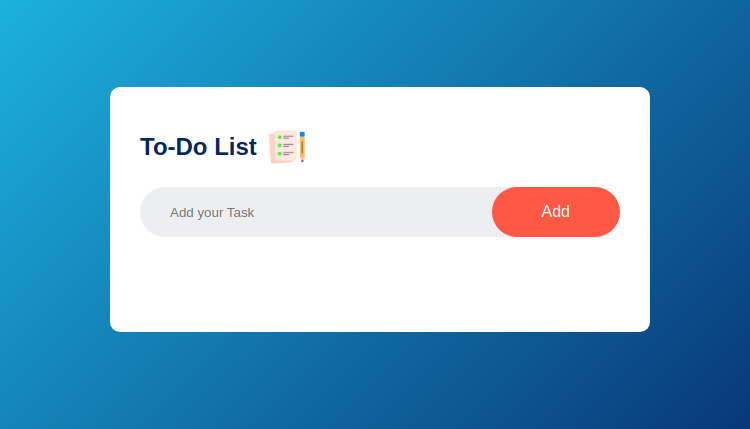

# Do-To-List

A simple and efficient To-Do List application to manage daily tasks effectively.



## Features
- Add, edit, and delete tasks
- Mark tasks as completed
- Save tasks locally for persistence
- User-friendly interface

## Installation

1. Clone the repository:
   ```bash
   git clone https://github.com/Naren456/Do-To-List.git
   ```
2. Navigate to the project directory:
   ```bash
   cd Do-To-List
   ```
3. Install dependencies (if required):
   ```bash
   npm install  # For Node.js projects
   ```

## Usage

Run the application:
```bash
npm start 
```

## Contact
For any queries, reach out to [your email or GitHub profile].

